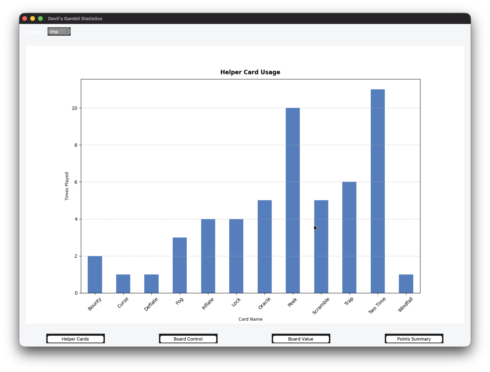
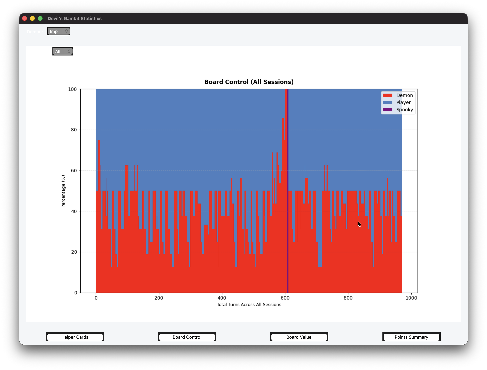
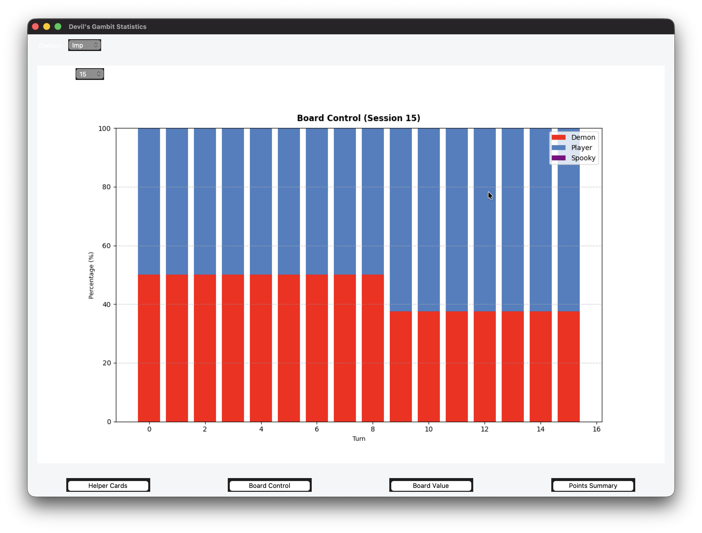
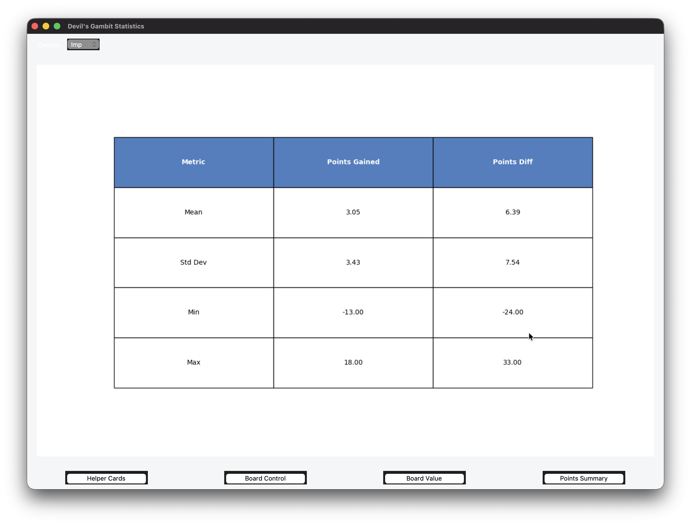
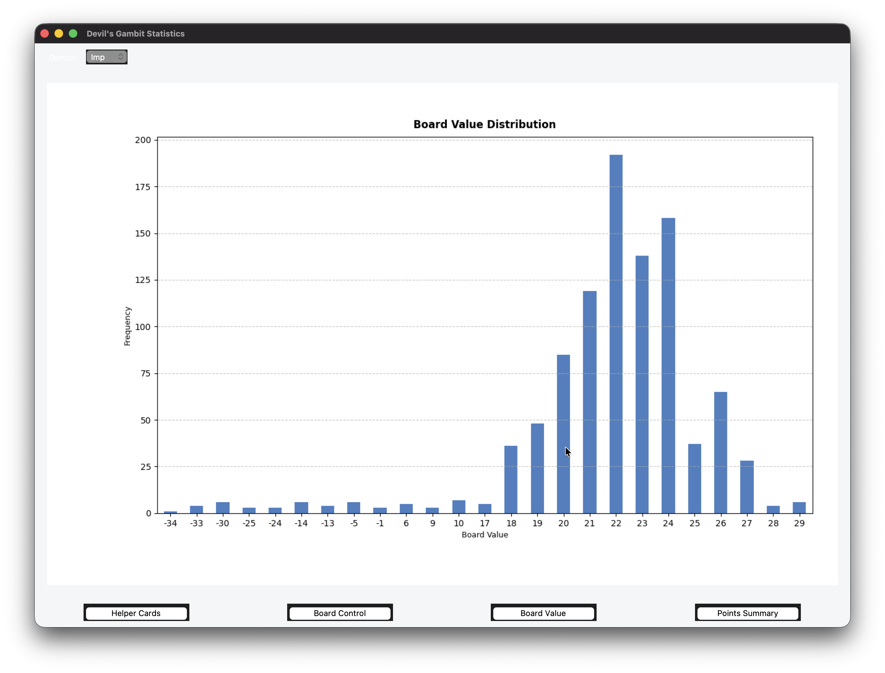

# Data Visualizations

This document provides an overview of the data visualizations from Devil Gambit gameplay statistics. Each graph has an option for demon selector (located on the top left of the app.)

## Graphs and Tables

### Bar Chart: Helper Usage

This bar chart shows which helper card types were used across sessions and how frequently each type was played. It gives a quick read on which helpers players lean on most against different demon matchups.

### Stacked Bar Graph: Board Control Over Time

This stacked bar graph shows the percentage of card ownership on the 4×4 grid at each point in the session, broken down between player and demon. 

Users can also select and view individual sessions can also be viewed separately.
This illustrates how board control shifts across turns, making it easy to spot swings in momentum or dominant stretches by either side.

### Statistics Table: Points Gained and Point Difference

This table provides a comprehensive breakdown of two key metrics — points gained per turn and point difference per turn. For each metric, the table reports mean, median, standard deviation, minimum, and maximum. It offers a concise summary of overall player performance and game momentum across a session or across multiple sessions.

### Histogram: Board Value Distribution

This histogram shows what value ranges the board tends to occupy most frequently. It reveals whether gameplay clusters around low, mid, or high total board values, and how spread out or concentrated those values are across a typical session.